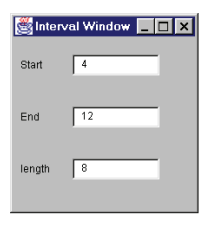

## Organizing Data

- #### Change Value to Reference
Эта техника помогает решить проблему существования одинаковых экзепляров класса, которые на самом деле представляют один объект
**Before**

```csharp
public class Customer
{
  public string Name
  {
    get;
    set;
  }

    // TODO:Replace Constructor with Factory Method.
  public Customer(string name)
  {
    this.Name = name;
  }
}

public class Order
{
  // ...
    private Customer customer;

    public string CustomerName
    {
        get { return customer.Name; }
        set { customer.Name = value; }
    }

    public Order(string customerName)
    {
        this.customer = new Customer(customerName);
    }
}

// Client code, which uses Order class.
private static int NumberOfOrdersFor(List<Order> orders, string customer)
{
    int result = 0;

    if (orders != null)
    {
        foreach (Order order in orders)
        {
            if (string.Equals(order.CustomerName, customer))
            {
                result++;
            }
        }
    }

    return result;
}
```

**After**

```csharp
public class Customer
{
    // 1.
    private static Hashtable instances = new Hashtable();

    public string Name
    {
        get;
        private set;
    }

    private Customer(string name)
    {
        this.Name = name;
    }

    public static Customer GetByName(string name)
    {
        return (Customer) instances[name];
    }

    //TODO: This code should be executed at the program launch.
    //This code can be changed to a Factory Method (with private constructor)
    // 2.
    public static void LoadCustomers()
    {
        new Customer("Lemon Car Hire").Store();
        new Customer("Associated Coffee Machines").Store();
        new Customer("Bilston Gasworks").Store();
    }
    private void Store()
    {
        instances.Add(this.Name, this);
    }
}

public class Order
{
  // ...
  private Customer customer;

  public string CustomerName
  {
    get { return customer.Name; }
  }

  public Order(string customerName)
  {
    SetCustomer(customerName);
  }

  public SetCustomer(string customerName)
  {
    // 3.
    customer = Customer.GetByName(customerName);
  }
}
//…
// Client code, which uses Order class.
private static int NumberOfOrdersFor(List<Order> orders, string customer)
{
  int result = 0;

  if (orders != null)
  {
    foreach (Order order in orders)
    {
        // 4.
        if (string.Equals(order.CustomerName, customer))
        {
            result++;
        }
    }
  }

  return result;
}
```

- #### Change Reference to Value

Для обеспечения неизменяемости объекта, он не должен иметь публичных сеттеров или других метожов меняющих его состояние. Присвоение значений полям объекта может быть только в конструкторе.
**Before**

```csharp
public class Customer
    {
    private static Hashtable instances = new Hashtable();

    public string Name
    {
        get;
        private set;
    }

    public DateTime BirthDate
    {
        get;
        set;
    }

    private Customer(string Name)
    {
        this.Name = Name;
    }

    public static Customer Get(string name)
    {
        Customer result = (Customer)instances[name];

        if (result == null)
        {
            result = new Customer(name);
            instances.Add(name, result);
        }

        return result;
    }
}

    // Somewhere in client code
    Customer john = Customer.Get("John Smith");
    john.BirthDate = new DateTime(1985, 1, 1);
```

**After**

```csharp
public class Customer
{
    public string Name
    {
        get;
        private set;
    }
    public DateTime BirthDate
    {
        get;
        // 1. to private
        private set;
    }

    // 2. use DateTime in constructor
    public Customer(string Name, DateTime BirthDate)
    {
        this.Name = Name;
        this.BirthDate = BirthDate;
    }

    // 3.1 value objects must be equal if name and date are equal
    public override bool Equals(Object obj)
    {
        Customer other = obj as Customer;

        if (other == null)
        return false;

        return this.BirthDate == other.BirthDate && string.Equals(this.Name, other.Name, StringComparison.Ordinal);
    }

    //3.2 in case of the C# lanuage
    public override int GetHashCode()
    {
        int hashCode = 11;
        unchecked
        {
        if (Name != null)
            hashCode = hashCode * 22 + Name.GetHashCode();
        hashCode = hashCode * 22 + BirthDate.GetHashCode();
        }
        return hashCode;
    }
}

// Somewhere in client code
Customer john = new Customer("John Smith", new DateTime(1985, 1, 1));
```


- #### Duplicate Observed Data
На примере GUI становится ясно, что код, обрабатывающий интерфейс пользователя, отделен от кода, обрабатывающего бизнес-логику. Если бизнес-логика встроена в интерфейс пользователя, необходимо разделить поведение на части (в основном с помощью декомпозиции и перемещения методов). Но данные нельзя перемещать, их надо скопировать и обеспечить механизм синхронизации.
**Before**

```csharp
public partial class IntervalWindow : Form
{
    public IntervalWindow()
    {
        InitializeComponent();
    }

    private void CalculateLength()
    {
        int start = int.Parse(tbStart.Text);
        int end = int.Parse(tbEnd.Text);
        int length = end - start;
        tbLength.Text = length.ToString();
    }
    private void CalculateEnd()
    {
        int start = int.Parse(tbStart.Text);
        int length = int.Parse(tbLength.Text);
        int end = start + length;
        tbEnd.Text = end.ToString();
    }

    private void OnTextBoxLeave(object sender, EventArgs e)
    {
        TextBox tb = sender as TextBox;
        
        if (tb != null)
        {
            int tmp;
            if (!int.TryParse(tb.Text, out tmp))
            {
                tb.Text = "0";
            }
            
            if (tb == tbStart)
            {
                CalculateLength();
            }
            else if (tb == tbEnd)
            {
                CalculateLength();
            }  
            else if (tb == tbLength)
            {
                CalculateEnd();
            }
        }
    }
}
```

Необходимо выделение всех перерасчётов длины и конечного значения в отдельный класс предметной области.
**After**

```csharp
// 3.1 mplement the Observer pattern. IObserver<Interval>
public partial class IntervalWindow : Form, IObserver<Interval>
{
    // 2. Create reference to Interval class
    private Interval subject;

    // set value if it changed in the observable class
    private string Start
    {
        get{ return subject.Start; }
        set{ subject.Start = value; }
    }
    private string End
    {
        get{ return subject.End; }
        set{ subject.End = value; }
    }
    private string Length
    {
        get{ return subject.Length; }
        set{ subject.Length = value; }
    }

    // 5.1 In constructor create interval instance and subscribe on
    public IntervalWindow()
    {
        InitializeComponent();

        subject = new Interval();
        subject.Subscribe(this);
        OnNext(subject);
    }

    // 4.1 Interface implementation
    public void OnNext(Interval interval)
    {
        tbStart.Text = interval.Start;
        tbEnd.Text = interval.End;
        tbLength.Text = interval.Length;
    }

    // No implementation needed: Method is not called by the Interval class.
    public void OnError(Exception e)
    {
        // No implementation.
    }

    // No implementation needed: Method is not called by the Interval class.
    public void OnCompleted()
    {
        // No implementation.
    }

    private void OnTextBoxLeave(object sender, EventArgs e)
    {
        // same logic as before
        TextBox tb = sender as TextBox;
        
        if (tb != null)
        {
            int tmp;
            if (!int.TryParse(tb.Text, out tmp))
            {
                tb.Text = "0";
            }
            
            if (tb == tbStart)
            {
                this.Start = tb.Text;
                subject.CalculateLength();
            }
            else if (tb == tbEnd)
            {
                this.End = tb.Text;
                subject.CalculateLength();
            }  
            else if (tb == tbLength)
            {
                this.Length = tb.Text;
                subject.CalculateEnd();
            }
        }
    }
}

// 1. Create separated domain class
// 3.1 mplement the Observer pattern. IObservable<Interval>
public class Interval: IObservable<Interval>
{
    // 4.3 observers (subscribers) storing
    private List<IObserver<Interval>> observers;
    private string  _start = "0",
                    _end = "0",
                    _length = "0";

    public string Start
    {
        get{ return _start; }
        // 6.2 when private field is changed this value is sent to subscribers
        set{ OnValueChanged(ref _start, value); }
    }
    public string End
    {
        get{ return _end; }
        set{ OnValueChanged(ref _end, value); }
    }
    public string Length
    {
        get{ return _length; }
        set{ OnValueChanged(ref _length, value); }
    }

    public Interval()
    {
        // 4.4 
        observers = new List<IObserver<Interval>>();
    }

    private void OnValueChanged(ref string oldValue, string newValue)
    {
        if (!string.Equals(oldValue, newValue, StringComparison.Ordinal))
        {
        oldValue = newValue;
        foreach (var observer in observers)
            observer.OnNext(this);
        }
    }

    // 4.2 Interface implementation
    public IDisposable Subscribe(IObserver<Interval> observer)
    {
        if (!observers.Contains(observer))
        {
            observers.Add(observer);
            observer.OnNext(this);
        }

        // For disposable subscribers
        return null;
    }

    // 6.1 now these methods calculate something and store it in private fields
    public void CalculateLength()
    {
        int start = int.Parse(this.Start);
        int end = int.Parse(this.End);
        int length = end - start;
        this.Length = length.ToString();
    }

    public void CalculateEnd()
    {
        int start = int.Parse(this.Start);
        int length = int.Parse(this.Length);
        int end = start + length;
        this.End = end.ToString();
    }
}
```

- #### Self Encapsulate Field

Если при доступе к полю родительского класса необходимо заменить обращение к переменной вычислением значения в подклассе, тогда можно использовать эту технику.
Самоинкапсуляция заключается в реализации доступа к полям через свойства, в том числе, в методах самого класса.
**Before**

```csharp
public class IntRange
{
    private int _low, _high;

    public IntRange(int low, int high)
    {
        _low = low;
        _high = high;
    }

    public bool Includes(int arg)
    {
        return arg >= _low && arg <= _high;
    }

    public void Scale(int factor)
    {
        _high = _high * factor;
    }
}
```

**After**

```csharp
public class IntRange
{
    // 1. reate properties that encapsulate our fields 
    private int Low
    {
        get;
        set;
    }
    private int High
    {
        get;
        set;
    }

    public IntRange(int low, int high)
    {
        // if setter logic is simple we can use it in constructor
        this.Low = low;
        this.High = high;
    }

    public bool Includes(int arg)
    {
        // 2. replace all references to fields with references to the corresponding properties
        return arg >= Low && arg <= High;
    }

    public void Scale(int factor)
    {
        // 2.
        High = High * factor;
    }
}
```

- #### Replace Data Value with Object

На начальных этапах разработки простые данные могут быть использованые в виде простых элементов. Например, телефон - строка. Позднее выяснится, что телефон может иметь код зоны или особое форматирование. В таких случаях необходимо преобразовать данные в объект.
**Before**

```csharp
public class Order
{
  // ...
  private string customer;

  public string Customer
  {
    get { return customer; }
    set { customer = value; }
  }

  public Order(string customer)
  {
    this.Customer = customer;
  }
}
//…
// Client code, which uses Order class.
private static int NumberOfOrdersFor(List<Order> orders, string customer)
{
    int result = 0;

    if (orders != null)
    {
        foreach (Order order in orders)
        {
            if (string.Equals(order.Customer, customer))
            {
                result++;
            }
        }
    }

    return result;
}
```

**After**

```csharp
public class Order
{
    // 2. change the type of the customer field and change the related methods and properties 
    private Customer customer;

    public string CustomerName
    {
        get { return customer.Name; }
        set { customer.Name = value; }
    }

    public Order(string customerName)
    {
        this.customer = new Customer(customerName);
    }
}

// 1. create a Customer class and move the other customer data and behaviors to this class
public class Customer
{
    public string Name
    {
        get;
        set;
    }

    public Customer(string name)
    {
        this.Name = name;
    }
}

// Client code, which uses Order class.
private static int NumberOfOrdersFor(List<Order> orders, string customer)
{
    int result = 0;

    if (orders != null)
    {
        foreach (Order order in orders)
        {
            // 3. use updated properties
            if (string.Equals(order.CustomerName, customer))
            {
                result++;
            }
        }
    }

  return result;
}
```

- #### Replace Array with Object

Tckb ceotcndetn массив, некоторые элементы которого могут означать разные сущности.
**Before**

```csharp
public class Tournament
{
    string[] row = new string[2];

    public Tournament()
    {
        row[0] = "Liverpool";
        row[1] = "15";
    }
    public void DisplayScore()
    {
        string name = row[0];
        int score = Convert.ToInt32(row[1]);
        // ...
    }
}
```

**After**

```csharp
public class Tournament
{
    // 2. Use the Perfomance class instead of array
    Performance row = new Performance();

    public Tournament()
    {
        row.CommandName = "Liverpool";
        row.Score = 15;
    }
    public void DisplayScore()
    {
        string name = row.CommandName;
        int score = row.Score;
        // ...
    }
}

// 1. Create class perfomance
public class Performance
{
    public string CommandName
    {
        get;
        set;
    }
    public int Score
    {
        get;
        set;
    }
}
```

- #### Change Unidirectional Association to Bidirectional

Метод поможет решить проблему, когда есть два класса, каждый из которых должен использовать функции другого, но ссылка между ними есть только в одном направлении.

**Before**

```csharp
public class Order
{
  // ...
  private Customer customer;

  public Customer Customer
  {
    get { return customer; }
    set { customer = value; }
  }
}

public class Customer
{
  // ...
}
```

**After**
Чтобы выбрать какой из классов будет отвечать за управление связью:

- Если оба объекта представляют собой объекты ссылок, и связь имеет тип «один-ко-многим», то управляющим будет объект, содержащий одну ссылку. (То есть если у одного клиента несколько заказов, связью управляет заказ.)
- Если один объект является компонентом другого (т. е. связь имеет тип «целое-часть»), управлять связью должен составной объект.
- Если оба объекта представляют собой объекты ссылок, и связь имеет тип «многие-ко-многим», то в качестве управляющего можно произвольно выбрать класс заказа или класс клиента.

```csharp
public class Order
{
  // ...
    private Customer customer;

    public Customer Customer
    {
        get { return customer; }
        set {
            // first direction
            // Remove order from old customer.
            if (customer != null)
            {
                customer.Orders.Remove(this);
            }

            customer = value;

            // Add order to new customer.
            if (customer != null)
            {
                customer.Orders.Add(this);
            }
        }
    }
}

public class Customer
{
    // 1. any customer can have multiple orders
    private HashSet<Order> orders = new HashSet<Order>();

    // Should be used in Order class only.
    public HashSet<Order> Orders
    {
        get { return orders; }
    }

    public void AddOrder(Order order)
    {
        // second direction
        order.Customer = this;
    }
}
```

- #### Change Bidirectional Association to Unidirectional

Двунаправленные связи удобны, но создают помехи в виде дополнительной сложности поддержки двусторонних ссылок и обеспечения корректности создания и удаления объектов. Сначала неободимо решить какой класс будет управляющим ("dominant").
**Before**

```csharp
public class Order
{
  // ...
  private Customer customer;

  public Customer Customer
  {
    get {
      return customer;
    }
    set {
      // Remove order from old customer.
      if (customer != null)
      {
        customer.Orders.Remove(this);
      }
      customer = value;
      // Add order to new customer.
      if (customer != null)
      {
        customer.Orders.Add(this);
      }
    }
  }

  public double GetDiscountedPrice()
  {
    return GetGrossPrice() * (1 - this.Customer.GetDiscount());
  }
}

public class Customer
{
  // ...
  private HashSet<Order> orders = new HashSet<Order>();

  // Should be used in Order class only.
  public HashSet<Order> Orders
  {
    get {
      return orders;
    }
  }

  public void AddOrder(Order order)
  {
    order.Customer = this;
  }

  public double GetPriceFor(Order order)
  {
     Assert.IsTrue(orders.Contains(order));
     return order.GetDiscountedPrice();
  }
}
```

**After**
Заказы должны появляться, только в том случае, если покупатель уже создан. Это позволяет отказаться от двусторонней связи между классами и избавиться от связи заказа к покупателю.

```csharp
public class Order
{
  // ...
    public Customer Customer
    {
        get {
        foreach (Customer customer in Customer.GetInstances())
        {
            if (customer.ContainsOrder(this))
            return customer;
        }
        return null;
        }
    }

    public double GetDiscountedPrice()
    {
        return GetGrossPrice() * (1 - this.Customer.GetDiscount());
    }
}

public class Customer
{
    // ...
    private HashSet<Order> orders = new HashSet<Order>();

    public void AddOrder(Order order)
    {
        orders.Add(order);
    }

    public double GetPriceFor(Order order)
    {
        Assert.IsTrue(orders.Contains(order));
        return order.GetDiscountedPrice();
    }
}
```

- #### Encapsulate Field
Инкапсуляция - основа ООП. Инкапсуляция поля делает свойства объекта связанными только с поведением объекта и не позволяет сторонним классам изменять состояние объекта.
**Before**

```csharp
class Person 
{
  public string name;
}
```

**After**

```csharp
class Person 
{
  private string _name;

  public string Name
  {
    get { return _name; }
    set { _name = value; }
  }
}
```

- #### Encapsulate Collection
Метод получения не должен возвращать сам объект коллекции, потому что
это позволило бы клиентам изменять содержимое коллекции без ведома владеющего ею класса. Не должно быть метода, присваивающего коллекции значение. Вместо этого должны быть операции для добавления и удаления элементов.
**Before**

```csharp
public class Course
{
  public bool IsAdvanced
  {
    get;
    set;
  }

  public Course(string name, bool isAdvanced = false)
  {
    // ...
  }
}

public class Person
{
  private List<Course> _courses;

  public List<Course> Courses
  {
    get
    {
      return _courses;
    }
    set
    {
      _courses = value;
    }
  }
}

// Client code
```

**After**

```csharp
public class Course
{
  public bool IsAdvanced
  {
    get;
    set;
  }

  public Course(string name, bool isAdvanced = false)
  {
    // ...
  }
}

public class Person
{
  private List<Course> courses = new List<Course>();

    // 1. return readonly collection
    public ReadOnlyCollection<Course> Courses
    {
        get
        {
            return new ReadOnlyCollection<Course>(courses);
        }
    }

    // 2. specific part of collection must be returned from base class
    public int NumberOfAdvancedCourses
    {
        get
        {
            int count = 0;
            foreach (Course c in courses)
            {
                if (c.IsAdvanced)
                count++;
            }

            return count;
        }
    }

    public int NumberOfCourses
    {
        get
        {
            return courses.Count;
        }
    }

    // 3.1 Add specific methods to control content in the collection 
    public void InitializeCourses(List<Course> newCourses)
    {
        Assert.IsTrue(courses.Count == 0);
        courses.AddRange(newCourses);
    }

    // 3.2
    public void AddCourse(Course course)
    {
        courses.Add(course);
    }

    // 3.3
    public void RemoveCourse(Course course)
    {
        courses.Remove(course);
    }
}

// Client code
```

- #### Replace Magic Number with Symbolic Constant

Используется для числовых значений имеющих смысл. Позволяет сделать код более очевидным.
**Before**

```csharp
double PotentialEnergy(double mass, double height) 
{
  return mass * height * 9.81;
}
```

**After**

```csharp
const double GRAVITATIONAL_CONSTANT = 9.81;

double PotentialEnergy(double mass, double height) 
{
  return mass * height * GRAVITATIONAL_CONSTANT;
}
```

- #### Replace Type Code with Class

Если заменить число классом, компилятор сможет проверять тип класса. Вероятность ошибок снижается, удобство использования кода и безопасность повышается
**Before**

```csharp
public class Person
{
    public const int O = 0,
        A = 1,
        B = 2,
        AB = 3;

    private int bloodGroupCode;

    public int BloodGroupCode
    {
        get{ return bloodGroupCode; }
        set{ bloodGroupCode = value; }
    }

    public Person(int code)
    {
        this.bloodGroupCode = code;
    }
}


// client code.
Person parent = new Person(Person.B);
// or
Person parent = new Person(3);
```

**After**

```csharp
public class Person
{
    // 5. Change field type to the new Class name
    private BloodGroup bloodGroup;

    public BloodGroup BloodGroup
    {
        get{ return bloodGroup; }
        set{ bloodGroup = value; }
    }

    public Person(BloodGroup bloodGroup)
    {
        this.bloodGroup = bloodGroup;
    }
}


// 1. Create a new class 
public class BloodGroup
{
    // 2.1 move the blood type field from the Person class
    private int_ code;
    // 2.2 move the blood getter and the constructor from the Person class 
    public int Code
    {
        get{ return _code; }
    }
    
    // 4. Change constructor visibility modifier to private
    private BloodGroup(int code)
    {
        _code = code;
    }

    // 3. Create static getters
    public static BloodGroup O
    {
        get{ return new BloodGroup(0); }
    }
    public static BloodGroup A
    {
        get{ return new BloodGroup(1); }
    }
    public static BloodGroup B
    {
        get{ return new BloodGroup(2); }
    }
    public static BloodGroup AB
    {
        get{ return new BloodGroup(3); }
    }
}

Person parent = new Person(BloodGroup.O);
```

- #### Replace Type Code with Subclasses

Если код типа влияет на поведение, то вариантное поведение лучше всего организовать с помощью полиморфизма. Код типа должен быть заменен иерархией наследования, содержащей полиморфное поведение. В такой иерархии наследования имеются подклассы для каждого кода типа
**Before**

```csharp
public class Employee
{
    public const int ENGINEER = 0,
        SALESMAN = 1,
        MANAGER = 2;

    public int type;

    public int MonthlySalary { get; set; }
    public int Commission { get; set; }
    public int Bonus { get; set; }

    public Employee(int type)
    {
        this.type = type;
    }

    public int PayAmount()
    {
        switch (type)
        {
            case ENGINEER:
                return MonthlySalary;
            case SALESMAN:
                return MonthlySalary + Commission;
            case MANAGER:
                return MonthlySalary + Bonus;
            default:
                throw new Exception("Incorrect Employee Code");
        }
    }
}

var employee = new Employee(Employee.MANAGER);
```

**After**

```csharp
public abstract class Employee
{
    // ...
    public const int ENGINEER = 0,
        SALESMAN = 1,
        MANAGER = 2;

    // 1. Type now is abstract -> each subtype can override it
    public abstract int Type { get; }
    public int MonthlySalary { get; set; }


    // 2. Replace the constructor by factory method
    public static Employee Create(int type)
    {
        switch (type)
        {
            case ENGINEER:
                return new Engineer();
            case SALESMAN:
                return new Salesman();
            case MANAGER:
                return new Manager();
            default:
                throw new Exception("Incorrect Employee Code");
        }
    }

    // 4. Add possibility for override this method by adding 'virtual' modifier 
    public virtual int PayAmount()
    {
        return MonthlySalary;
    }
}

// 3. Create Engineer class and add an override method of the parent class Type property 
public class Engineer : Employee
{
    public override int Type => ENGINEER;
}

// 4. Add all subclasses and then change the main class constructor
public class Salesman : Employee
{
    public override int Type => SALESMAN;
/*
    public int Commission { get; set; }

    public override int PayAmount()
    {
        return MonthlySalary + Commission;
    }
*/
}

public class Manager : Employee
{
    public override int Type => MANAGER;
/*
    public int Bonus { get; set; }

    public override int PayAmount()
    {
        return MonthlySalary + Bonus;
    }
*/
}
```

- #### Replace Type Code with State/Strategy

Этот метод аналогичен предыдщуему, но позволяет работать с объектами, у которых в течение жизни может изменится тип. Здесь применяется паттерн "Состояние/Стратегия"
**Before**

```csharp
public class Employee
{
    // ...
    public const int ENGINEER = 0,
        SALESMAN = 1,
        MANAGER = 2;

    public int type;

    public int MonthlySalary { get; set; }
    public int Commission { get; set; }
    public int Bonus { get; set; }

    public Employee(int type)
    {
        this.type = type;
    }

    public int PayAmount()
    {
        switch (type)
        {
            case ENGINEER:
                return MonthlySalary;
            case SALESMAN:
                return MonthlySalary + Commission;
            case MANAGER:
                return MonthlySalary + Bonus;
            default:
                throw new Exception("Incorrect Employee Code");
        }
    }
}
```

**After**

```csharp
public class Employee
{
    // 4.1 Create EmployeeType field
    private EmployeeType type;

    // 4.2 Create EmployeeCode field
    // 4.3 Call the EmployeeType.Create method in setter to update the state of Employee
    public int EmployeeCode
    {
        get => type.EmployeeCode;
        set => type = EmployeeType.Create(value);
    }

    public int MonthlySalary { get; set; }
    public int Commission { get; set; }
    public int Bonus { get; set; }

    public Employee(int employeeCode)
    {
        type = EmployeeType.Create(employeeCode);
    }

    public int PayAmount()
    {
        return type.PayAmount(this);
    }
}


// 1. Create abstract class EmployeeType int property
public abstract class EmployeeType
{
    public const int ENGINEER = 0,
        SALESMAN = 1,
        MANAGER = 2;

    public abstract int EmployeeCode { get; }

    // 3. Create Factory Method with switch statement
    public static EmployeeType Create(int code)
    {
        switch (code)
        {
            case ENGINEER:
                return new Engineer();
            case SALESMAN:
                return new Salesman();
            case MANAGER:
                return new Manager();
            default:
                throw new Exception("Incorrect Employee Code");
        }
    }

    // 4. Move PayAmount method 
    public abstract int PayAmount(Employee employee);
}


// 2. create all implementations of EmployeeType class
public class Engineer : EmployeeType
{
    public override int EmployeeCode => ENGINEER;

    // 5. Override PayAmount in all implementatios
    public override int PayAmount(Employee employee)
    {
        return employee.MonthlySalary;
    }
}

public class Salesman : EmployeeType
{
    public override int EmployeeCode => SALESMAN;

    public override int PayAmount(Employee employee)
    {
        return employee.MonthlySalary + employee.Commission;
    }
}

public class Manager : EmployeeType
{
    public override int EmployeeCode => MANAGER;

    public override int PayAmount(Employee employee)
    {
        return employee.MonthlySalary + employee.Bonus;
    }
}
```

- #### Replace Subclass with Fields

**Before**
Есть подклассы, которые различаются только методами, возвращающими данные константы. Применение такого типа рефакторинга - это замена методов полями в родительском классе и удаление подкласов.

```csharp
public abstract class Person
{
    public abstract bool IsMale { get; }
    public abstract char Code { get; }
}

public class Male : Person
{
    public override bool IsMale => true;
    public override char Code => 'M';
}

public class Female : Person
{
    public override bool IsMale => false;

    public override char Code => 'F';
}
```

**After**

```csharp
public class Person
{
    private bool isMale;
    private char code;

    // 3. Add getters for each field
    public bool IsMale => isMale;

    public char Code => code;

    // 2. Protected constructor
    protected Person(bool isMale, char code)
    {
        this.isMale = isMale;
        this.code = code;
    }

    // 1. Create factory methods to substitute constructors from child classes
    public static Person CreateMale()
    {
        return new Person(true, 'M');
    }

    public static Person CreateFemale()
    {
        return new Person(false, 'F');
    }
}
```
